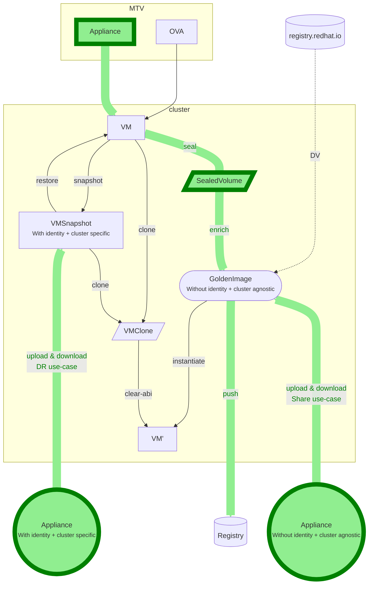

# Appliance in KubeVirt

_Golden Image (GI)_ - An "enriched" boot source to create a VM.
GI requires a Preference annotation.
The system is using the preference and a user provided instanceType
to generate the VM spec.

- Boot disk only
- No resources
- No VN boilerplate / customization

In contrast, an _Appliance_ is also build around a golden image, but
this golden image contains a VM boilerplate which can in turn
reference all reqiured resources, such as multiple disks or networks

### Instantiation

The creation of a VM from an Appliance is similar to creating one
from a GI.
The key differences is:
VM boilerplate is provided, and not generated (as in GI)

This allows to specify all details of a VM as part of the metadata.
Including additional disks, networks etc.

GI Creation Flow
1. Given a `DataSource`
2. System reads Preference and InstanceType from `DataSource`
3. System generates a VM boilerplate with Pref and IT
4. System creates VM

Appliance Creation Flow
1. Given a `DataSource`
2. System reads _VM boilerplate_ from `DataSource`
3. System _completes the provided VM boilerplate_
4. System creates VM

## Examples

## Golden Image
```yaml
apiVersion: cdi.kubevirt.io/v1beta1
kind: DataSource
metadata:
  name: fedora
  namespace: openshift-virtualization-os-images
  labels:
    instancetype.kubevirt.io/default-instancetype: server.medium
    instancetype.kubevirt.io/default-preference: fedora
spec:
  source:
    pvc:
      name: fedora-f7cc15256f08
      namespace: openshift-virtualization-os-images
status: {}
```

## Appliance
```yaml
apiVersion: cdi.kubevirt.io/v1beta1
kind: DataSource
metadata:
  name: static-data-appliance
  labels:
    instancetype.kubevirt.io/default-instancetype: server.medium
    instancetype.kubevirt.io/default-preference: fedora
  annotations:
    appliance.kubevirt.io/vm-spec: |
      apiVersion: kubevirt.io/v1
      kind: VirtualMachine
      spec:
        dataVolumeTemplates:
          - metadata:
              creationTimestamp: null
              name: diplomatic-tortoise-volume  ## FIXME
            spec:
              sourceRef:
                kind: DataSource
                name: fedora
                namespace: openshift-virtualization-os-images
              storage:
                resources:
                  requests:
                    storage: '34087042032'
        instancetype:
          kind: virtualmachineclusterinstancetype
          name: n1.xlarge
        preference:
          kind: virtualmachineclusterpreference
          name: fedora
        runStrategy: Running
        template:
          spec:
            domain:
              devices:
                disks:
                  - disk:
                      bus: virtio
                    name: diplomatic-tortoise-disk
                  - disk:
                      bus: virtio
                    name: cloudinitdisk
              resources: {}
            volumes:
              - dataVolume:
                  name: diplomatic-tortoise-volume
                name: diplomatic-tortoise-disk
              - cloudInitNoCloud:
                  userData: |-
                    #cloud-config
                    user: cloud-user
                    password: 7lx3-sx9f-5pm9
                    chpasswd: { expire: False }
                name: cloudinitdisk
            filesystems:
              - persistenVolumeClaim:
                  claimName: shared-static-data
spec:
  source:
    pvc:
      name: fedora-f7cc15256f08
      namespace: openshift-virtualization-os-images
status: {}
---
apiVersion: v1
kind: PersistentVolumeClaim
metadata:
  name: shared-static-data
  ownerReferences:
  - apiVersion: cdi.kubevirt.io/v1beta1
    blockOwnerDeletion: true
    controller: true
    kind: DataSource
    name: static-data-appliance
spec:
  accessModes:
    - ReadWriteMany
  volumeMode: Filesystem
  resources:
    requests:
      storage: 8Gi
  storageClassName: slow
```

## Workflow Diagram


