# Overview

This document is about Golden Images in the context of OpenShift Virtualization [^2].

> **Note**
> This document does not necessarily outline the current featureset in OpenShift Virtualization, but rather the overarching concept as it is planned to be implemented.

Golden Images[^1] - or Baseline Images - are a tool or concept to prepare VMs, in order to have them created quickly upon request by a consumer.

There are different personas which are interested to provide prepared VMs:
- A vendor, in order to allow a consumer to quickly use an OS or an appliance
- An admin, a cluster owner, in order to provide a tailored VM in a specific site, with specific apps or resources
- A team lead, a platform engineer, in order to provide a tailored VM for his/her/their team, with specific apps or resources
- A user him/her/themself, in order to recreate a previous VM again

The VM specifications in the use-cases above primarily differentiate in their degree of specification.
- A vendor does not know about resources of their customers, thus usually resources are vaguely specified (no specific GPU for example). The same is true for applications.
- A cluster admin, a cluster owner, knows about the phyical resources, and possibly org authentication details, but not necessarily about team applications.
- A team lead, platform engineer, knows about applications.

And - as often in life - there is everything in between.

> **Note**
> Appliances are not yet covered below. TBD

OpenShift Virtualization offers two general mechanisms to cover the use-cases above.

- Golden Images
- Bookmarked VMs (Not in 4.13, FUTURE)

They key difference between both of them can be taken from their names:
- Golden *Images* - The artifact to consume is an *image / volume*
- Bookmarked *VMs* - The artifact to consume is a *VM*

Images - Volumes - are _agnostic_. They do not have any specific VM definition attached and are site, cluster, resource, and application _agnostic_.
Bookmarked VMs _are_ _specific_. They are complete VMs - in a saved state - and can thus contain everything that can be defined on a VM, and can thus be site, cluster, resource, and application _specific_.

Bookmarked VMs are not the subject of this document, but can be found [here TBD](TBD).

<p style="text-align: center; font-size: 5em">&horbar;</p>

# The Golden Image Pattern

> **Note**
> The description below is the anticipated goal for Golden Images in OpenShift Virtualization.
> Todays (4.11) implementation differs due to the use of OCP Templates.
> Thus take this document rather as a documentation of a future state.

## Introduction

"Golden Images" are not a new concept[^1]. In one way or the other, golden images define an image which is optimized for a fleet, organization, group, a team, or a site, or some other conext. The content and specifics of the image will differ depending on the audience.
However, the key property will not change: The image is *ready to use* for consumers by letting them instantiate new VMs based on the golden image.

The concept is powerful and increases effiency.
The out-of-the-box OpenShift Virtualization is providing golden, ready-to-use images for selected Red Hat and commnuity operating systems, like RHEL, Fedora, and CentOS.
This out-of-the-box configuration is build on a couple of reusable building blocks in order to empower additional personas of a cluster to modify or create extended workflows.

In this document we are going to
- Look at the concept, building blocks, and basic flow
- The default flow for vendor provided images
- How to customize the default flow

Let's take a look at some benefits and use-cases for golden images:

### Key benefits

- A single source of truth leveraged by multiple consumers
- Efficient and fast readiness in the local environment
- Low external bandwidth requirements due to import-once-cache-local approach

### User Stories

- As a vendor or platform engineer I want to provide easy-to-use and up-to-date images to my customers
- As a cluster admin or platform engineer I want to provide ready-to-use and up-to-date images to my users in their cluster
- As a VM owner I want to use ready-to-use and up-to-date images to quickly create my VMs within my cluster


## Building blocks

Let's take a look at the core building blocks of the golden image flow before diving into the concept and its implementation.

### Operating System Image

An operating system image is usually a file within an OpenShift PV, a ContainerDisk, or even a local raw or qcow2 file on your machine.
Such an image is used to provide the base virtual disk for a VM.

### Persistent Volume

Persistent Volumes are the persistent storage mechanism of Kubernetes and OpenShift.
If an operating system image is uploaded into an OpenShift cluster - i.e. using CDI or virtctl image-upload - then it will be placed in such a PVC.
The main benefits of PVCs are to provide - if the CSI driver is supporting it - sophisticated storage features such as cloning, snapshoting, backup and restore.

### Container Disks

ContainerDisks are container images with an operating system image stored inside.
The benefit of having an operating system within a container image is, that such a container image can be stored in a container registry and that other container image semantics such as pull-once-cache-local apply. ContainerDisks are a useful tool for operating system delivery or stateless workloads. However, there are certain i.e. size limitations.

### Containerized Data Importer, DataVolumes, and DataCronImport

The Containerized Data Importer (CDI) is the defacto standard tool for importing operating system images into a Kubernetes cluster.
One of the APIs to achieve that, is the `DataVolume` API.
`DataVolumes` are populating PVCs from a wide range of sources, i.e. by importing an operating system image from a URL, taking it from an upload source, or by cloning an existing PVC.
`DataCronImports` are an API, provided by CDI, to mirror ContainerDisks into PVCs on a specified schedule. The added benefit is, that a `DataCronImport` can be pointed to a specific tag of a container image, inside a registry, and it will automatically import new tags into PVCs whenever a new ContainerDisk was published and tagged.
`DataCronImports` are used by OpenShift in order to automatically import Red Hat provided operating system images into a cluster.

### Images, Preferences and InstanceTypes

Technically speaking, an image is not enough to make a VM run or run with the best possible performance. This gap is closed by InstanceTypes and Preferences[^3][^4].
In a nutshell Preferences are telling the system what device types an operating system is prefering (therefore the name). To some extent a preference therefore needs to reflect the operating system which is present in an operating system image.
InstanceTypes on the other hand are defining the compute resources that should be provided to a virtual machine.

A PVC holding an operating system image is usually labeled with the recommended Preference for the guest.
The InstanceType is usually chosen by the user whenever a VM is getting created from a PVC.

The OpenShift provided InstanceTypes and Preferences are quite workload agnostic, and can be used with a wide range of images and operating systems.

For now we can assume that the Preferences and InstanceTypes provided by OpenShift are sufficient to run most operating systems.

While it's not commonly needed, InstanceTypes and Preferences can still be customized, this is covered in [this document](TBD).


## Concept

In order to understand the concept, let's look at the specific golden images implementation in OpenShift Virtualization: 

> Red Hat is providing golden images hosted on quay, in order to be imported into clusters for fast RHEL 8 and 9, Fedora, and CentOS provisioning.

The following three workflows are the pillars of this golden image concept:

1. Publishing an operating system image via a container registry
2. In-Cluster provisioning from registry
3. In-Cluster consumption from provisioning template

These steps are owned by different personas:

Environment | Action    | Persona
------------|-----------|-----------------------------------
Registry    | Publish   | Vendor or Platform Engineer
In-Cluster  | Provision | Cluster Admin or Platform Engineer
In-Cluster  | Consume   | VM Owner

Let's deep dive into each of these steps:

### 1. Registry provisioning - Publish ContainerDisks to Registries
The first step to achieve this, is to make these operating systems available in a such way that they can be retrieved on an OpenShift cluster - also in i.e. disconnected scenarios. Red Hat is publishing [ContainerDisks](LINK) in the [Red Hat Container Registry](LINK) for the RHEL versions. The Fedora and CentOS versions are [maintained by the community](https://quay.io/organization/containerdisks).

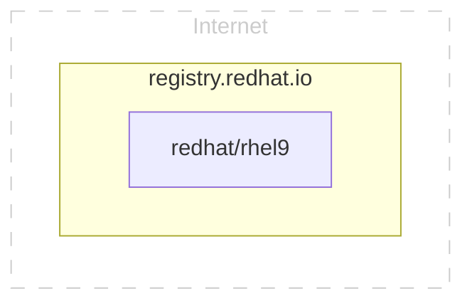

### 2. In-Cluster provisioning - Import ContainerDisk to a local cluster
The ContainerDisks are now available on the internet.
In order to provide stability ("the same image over time"), and fast VM creation times, each ContainerDisk is imported into a PVC on the local cluster, in order to benefit from the smart storage features of the cluster's CSI provider.
The import of the ContainerDisks is triggered by a `DataImportCron`, which will expose the import results in so called `DataSources`.
VMs and `DataVolumes` can be cloned from `DataSources` respectively their underlying PVCs.
The `DataSource` is located in the _shared_ `openshift-virtualization-os-images` namespace, in order to allow all cluster users to clone these images and eventually create VMs from them.

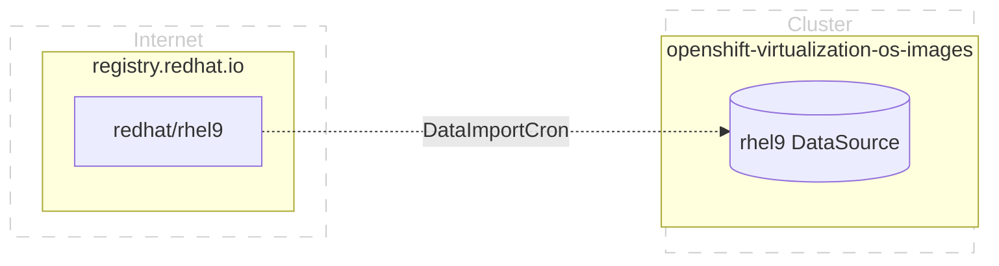

### 3. In-Cluster consumption - Clone the Golden Image i.e. during VM creation
In the last step, a user can use a `DataVolume` in order to clone a `DataSource` in order to run a VM.
Alternatively the `DataVolumeTemplate` section can be used in a VM definition.

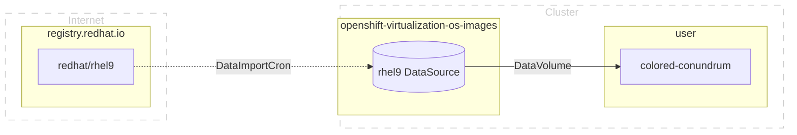

By using this cluster local golden image jointly with smart storage, OpenShift Virtualization is capable of spinning up new VMs within a matter of seconds.

These golden images are also used by the OpenShift Console when creating VMs from the catalog.

## Summary - Golden Image Flow

If we bubble up from the details, then we get to the three elementary steps of the golden image flow:
1. Registry provisioning - A remote source serving to be imported by multiple clusters
2. In-Cluster provisioning - An import to a locally cached (for users) read-only volume
3. In-Cluster consumption - Automation to create on-demand read-write volumes for requesters

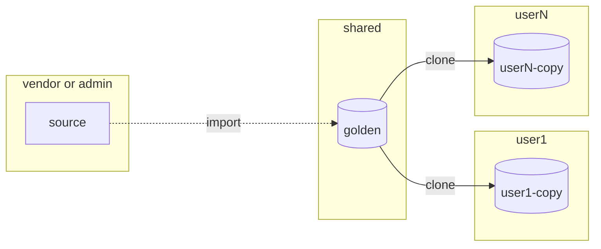

## Workflows

### Registry: Publish golden images

This is a vendor specific process and there are many ways of building ContainerDisks, but for the sake of simplicity the workflow below depicts the common principle of ContainerDisks and the easiest way without requiring specialized tooling. It is using a pre-built disk image and a simple Containerfile, to package the disk image into a container image.

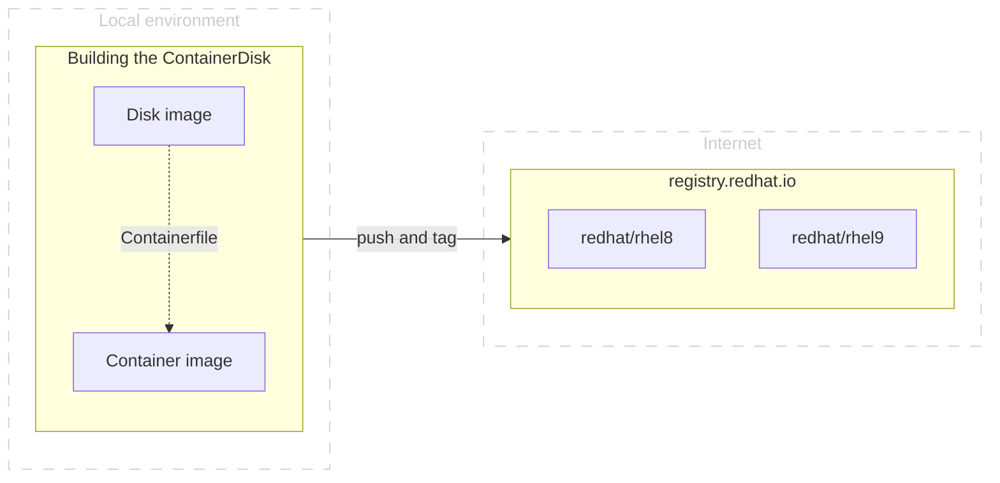

Here is an example of such a simple `Containerfile`:

```
FROM scratch
ADD my-disk-image.qcow2 /disk/
```

This `Containerfile` can be utilized by standard tooling such as podman or buildah. This approach is not limited to local environments, it can also be used as the last step in a CI pipeline, to publish the disk image artifact after building it.

Of course, ContainerDisks can also be created in code by specialized tooling.
For an example on how the community publishes their images see [here](https://github.com/kubevirt/containerdisks).

### In-Cluster: Provision golden images

TBD

### In-Cluster: Consume golden images

From a user's perspective the consumption of golden images is almost trivial.

As a user I'm chosing one of the `DataSources` in the `openshift-virtualization-os-images` namespace.
The `DataSource` can be used to create a new VM, or to create a clone into a plain PVC. Both flows leverage the `DataVolume` API.

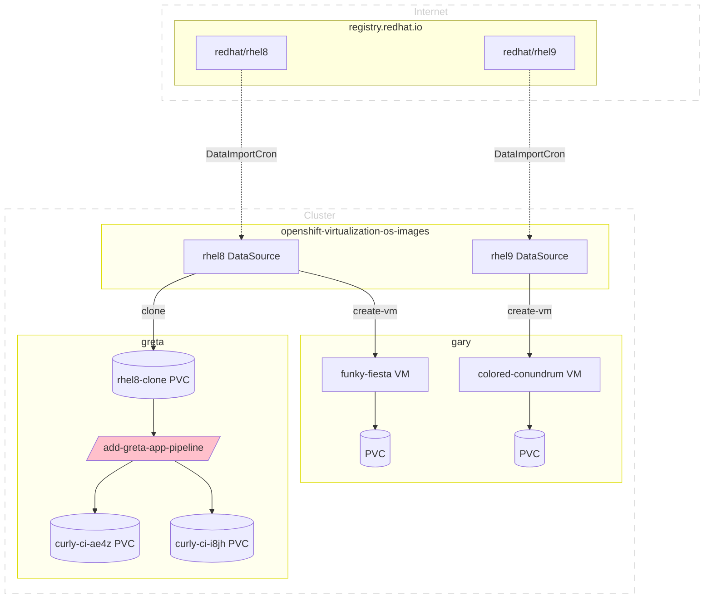

<p style="text-align: center; font-size: 5em">&horbar;</p>

# Custom Golden Images

Golden images can be customized at different stages

- As a cluster-admin on the cluster level
- As a user within a project or namespace

## Cluster-Level

Golden images are - by default (RBAC) - owned by the cluster administrator.

An administrator (or a differen user with the relevant permissions) can change the flow, in order to customize the images before users can clone them.
This works as follows:

1. The administrator configures the system to import ContainerDisks into a private/non-shared namespace
2. The administrator creates pipelines in the private namespace to modify the vendor images, and output new modified images.
3. The administrator configures the piepeline to output the new modified images into the shared namespace - under the well known vendor golden image or a custom name.

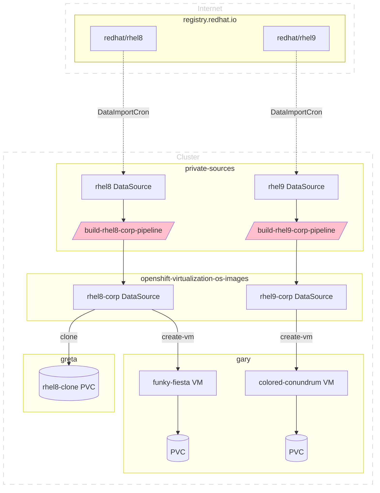

## Namespace-level

A user can create custom golden images in a namespace or project when having the relevant permissions.
An easy way to accomplish this is by using Tekton pipelines - just like it was done on the cluster level - for automatically deriving a custom image from existing golden images.

This works as follows:

1. The user creates a pipeline in a namespace to clone and modify an existing golden image, and to output new modified images.

The graph below is almost identical to the one above, except for the newly added `add-greta-app-pipeline` pipeline in the `greta` namespace.

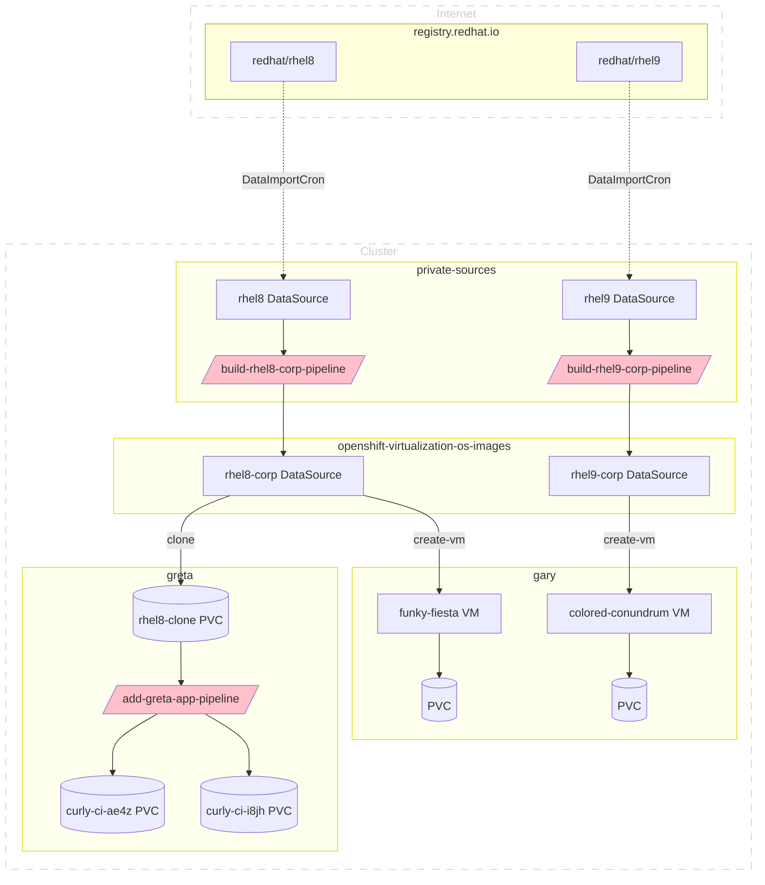


### User workflow

Given the setup above, the personas could act as follows:

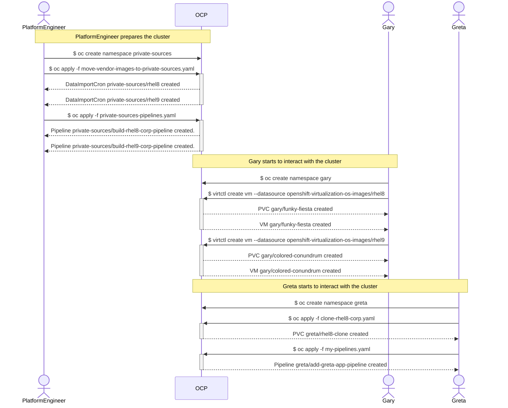


<p style="text-align: center; font-size: 5em">&horbar;</p>


# Golden Images in a Multi-Cluster scenario

Golden images are "blessed" images in a cluster in order to create VMs.
In this section we are looking at how this pattern can be used in a multi-cluster scenario.

> **Note**
> OpenShift's multi-cluster solution is the Advanced Cluster Manager (ACM). 
> In this section we are relying on ACM's terminology for describing the cluster roles.

## Overview

In a multi-cluster scenario, the consumption of golden images _within a single cluster_ is exactly as described above: A registry is providing a ContainerDisk, which is getting imported into a cluster using a `DataCronImport`.


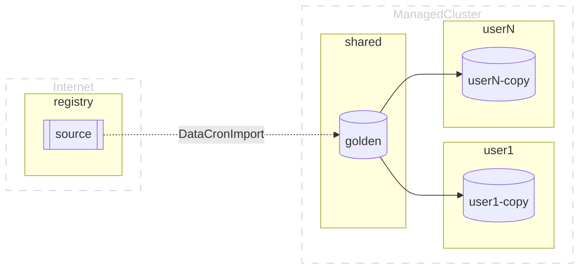

The main challenge for golden image distribution in a multi-cluster scenario is to propagate the custom or vendor specific golden images in a _consistent_ way to all or selected managed clusters.

### Eventual consistency with a single source of truth

In order to achieve consistency, the _single source of truth_ principle[^5] is - just like in GitOps - followed.

Today, in a single cluster, a `DataCronImport` and the associated _ContainerDisk_ are the _source of truth_ for a golden image within a single cluster.
For multiple clusters the very same _ContainerDisk_ which is used for a single cluster, will become the _single source of truth_ for all managed clusters:

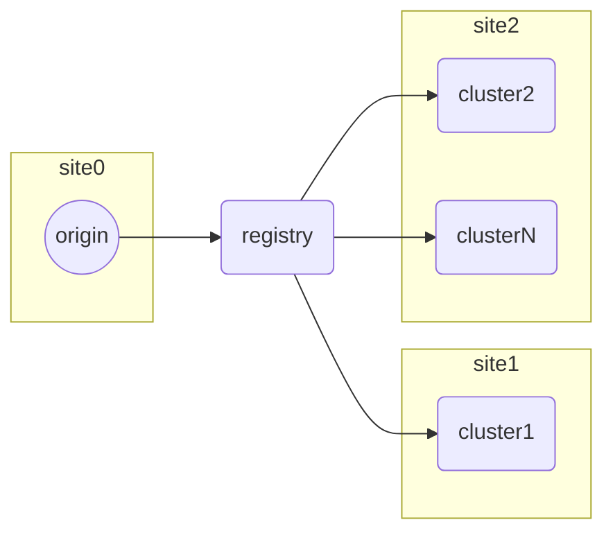

Because the _ContainerDisk_ in the registry is becoming the central point of distribution, this section is focusing on how to build and publish golden images to a container registry (let it be public or private).

### Building blocks

This is - in essence - achieved by:

1. A platform engineer to _build_ golden images in an "origin" cluster
2. A platform engineer to _push_ golden images to a private or public registry
3. A platform engineer to _distribute_ `DataCronImport` to managed clusters by using ArgoCD in order to import the golden images from the previously used registry

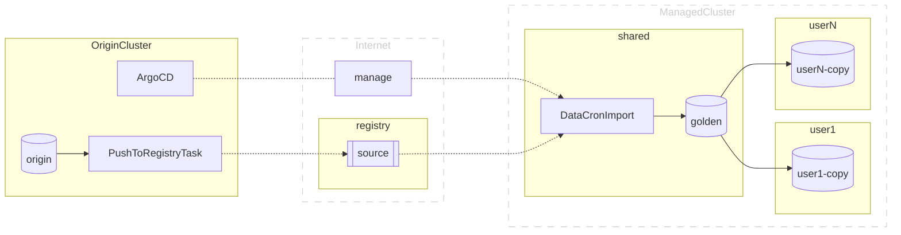

### Prerequisites
The prerequisites for this workflow are:

1. Advanced Cluster Manager and ArgoCD respectively OpenShift GitOps
2. Access to a private or public registry
3. Access to a private or public git repository to be used with ArgoCD
4. The ACM hub or a dedicated cluster for preparing golden images

### User Stories

1. As an admin of several clusters, I want to compose a golden image and get it replicated consistently to all of my clusters, in order to enable the golden image flow in each cluster.
2. As an admin of several clusters, I want to limit the golden images in the managed clusters to my custom golden images, and therefore remove all vendor provided golden images in managed clusters.

[^1]: https://www.redhat.com/en/topics/linux/what-is-a-golden-image
[^2]: https://openshift.com/virtualization
[^3]: https://kubevirt.io/user-guide/virtual_machines/instancetypes/
[^4]: https://github.com/fabiand/instanceTypes
[^5]: https://www.redhat.com/architect/single-source-truth-architecture
